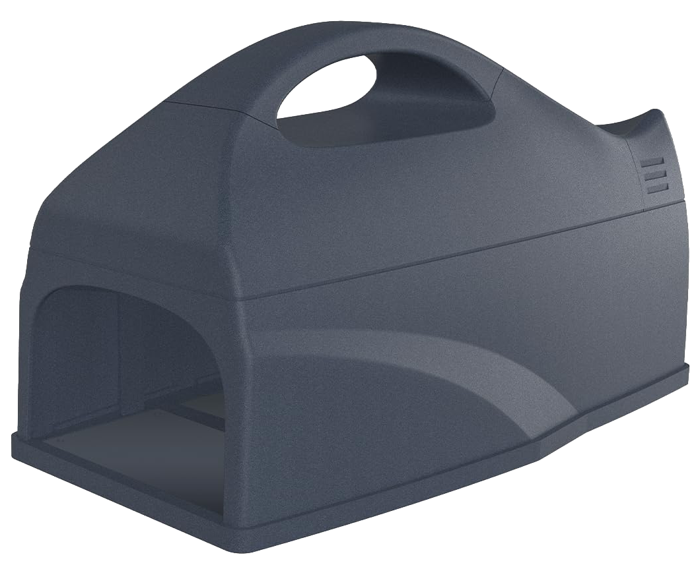
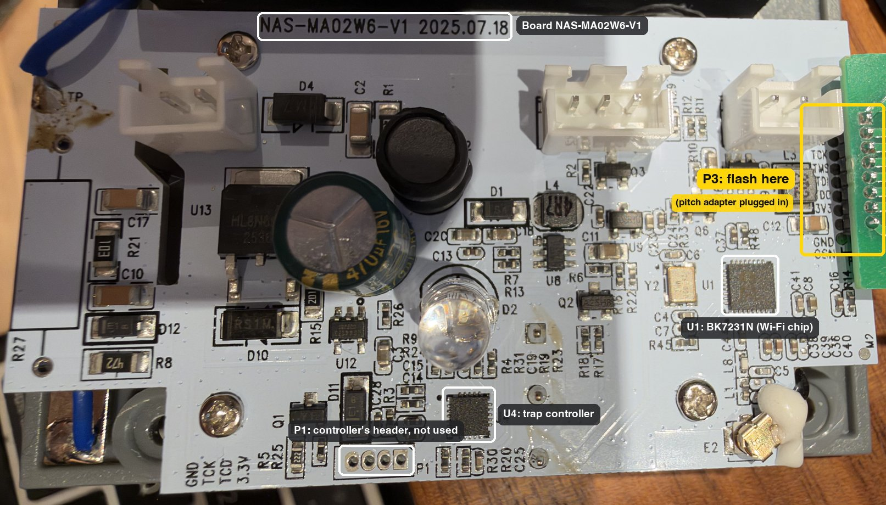
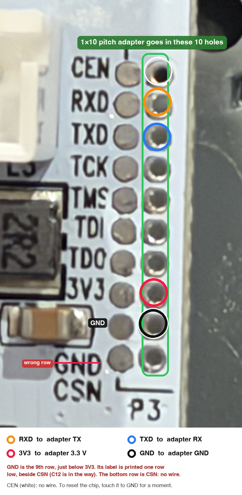
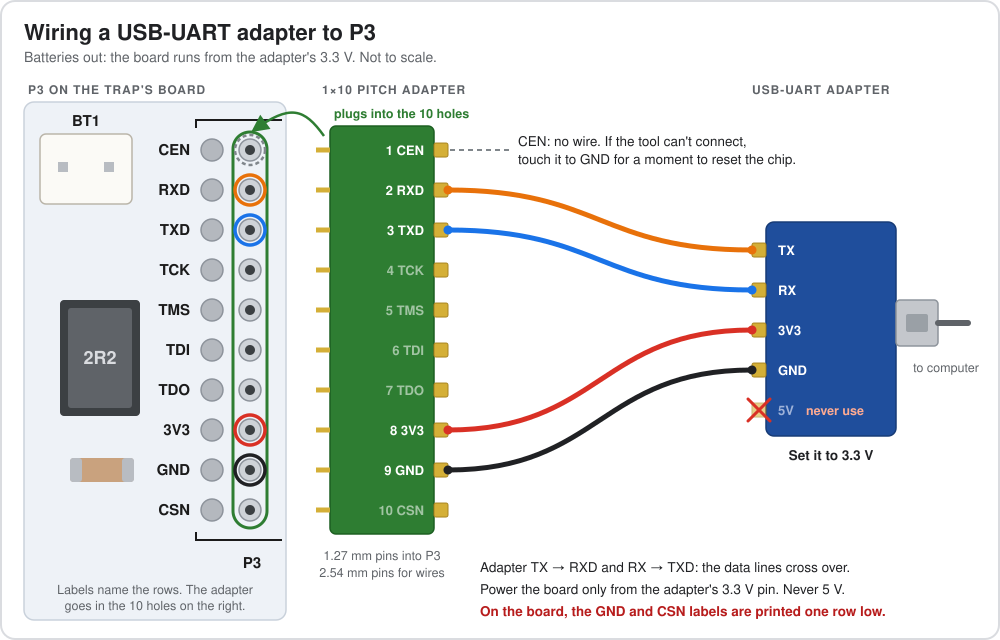
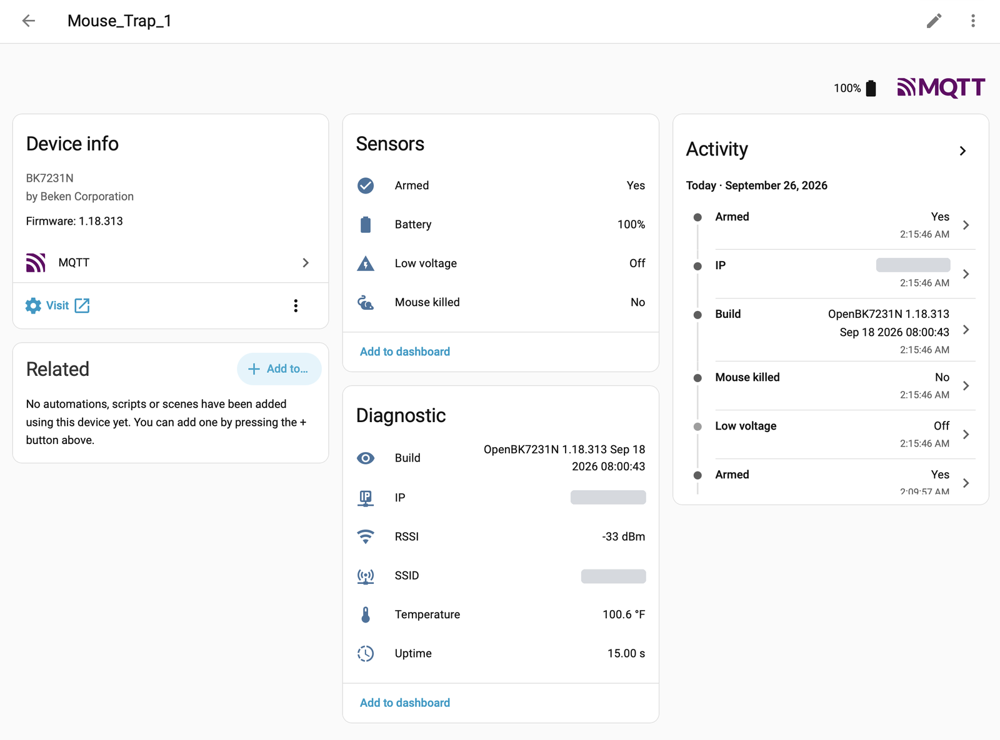

# Neo Coolcam mouse trap (NAS-MA02W6-V1) → OpenBeken → Home Assistant

<p align="center">
  
</p>

Replace the Tuya cloud firmware on the trap's BK7231N Wi-Fi chip with
[OpenBeken](https://github.com/openshwprojects/OpenBK7231T_App), and report whether the trap is
**armed**, when it **kills**, and its **battery level** to Home Assistant over MQTT, with no cloud.

```sh
git clone https://github.com/kedube/tuya-smart-mousetrap.git
cd tuya-smart-mousetrap
```

| File | What it's for |
| --- | --- |
| `openbeken/early.bat`, `openbeken/autoexec.bat` | OpenBeken's startup scripts for the trap (Step 2) |
| `homeassistant/mousetrap.yaml` | Optional Home Assistant package: alerts, a *last seen* sensor and icons (Step 3) |
| `update-trap.sh` | Sends a changed `autoexec.bat` to the trap while it runs on batteries |
| `capture-trap-log.sh` | Saves OpenBeken's log during the trap's short wake-ups |
| `watch-trap-wakes.sh` | Logs each time the trap wakes, with the time since the last wake |
| `trap.conf.example` | Template for `trap.conf`, which holds your trap's IP address for the scripts |
| `Images/` | Photos of the trap and its board, the wiring diagram, and a Home Assistant screenshot |

The scripts need `bash` and `curl` (`capture-trap-log.sh` also uses `perl`), so they run on macOS
and Linux (on Windows, use WSL).

## How this trap works

A dump of the original firmware and the board photos show that the BK7231N does **not** run the
trap. There are two chips:

| Part | Role |
| --- | --- |
| **U4**, a separate MCU (SWD header P1: GND/TCK/TCD/3.3V) | Runs the trap: high-voltage generator, catch detection, battery measurement, LED. Controls power to the Wi-Fi chip. |
| **U1**, a BK7231N (UART header P3) | Wi-Fi bridge only. It is powered on when the MCU has something to report, receives the data over UART, sends it to the cloud, and is then switched off. |



*The board with the case open. P3, where you connect for flashing, is on the right edge next to
the battery connector. Full-size photos: [board](Images/board.jpeg), [P3](Images/p3-header.jpeg),
[BK7231N](Images/bk7231n.jpeg).*

The two chips talk **TuyaMCU low-power protocol v0 at 9600 baud**. Evidence for this:
the dump's Tuya config has `baud_cfg: 9600`, and the MCU firmware version is 1.0.7 (`mst_tp_0: 9` = MCU;
1.0.8 after an update from the Tuya app).
On the NAS-MA01W sibling model, the captured frames were `55AA 00 05 …`, which is protocol version 0, command 0x05.

The datapoint schema stored in the dump (key `e1ms15fc`):

| dpID | Type | Meaning |
| --- | --- | --- |
| 101 | bool, read-only | **Mouse killed** (Tuya app name), shown in HA as *No* / *Yes*. The trap sends No every time it's switched on and Yes when it kills. It has no separate armed signal: a fresh No means it was just switched on. |
| 102 | enum 0–3, read-only | **Battery life** (Tuya app name), shown in HA as *Battery*. 0 = 100 % (new cells send 0; the Tuya app shows 100 %), 1 = 75 %, 2 = 50 %, 3 = 25 %. Sent on every wake. On the USB-UART adapter it sends 3 (25 %), so ignore it there. |
| 103 | bool, read-only | **Low voltage** (Tuya app name). 1 = replace the batteries. The trap hasn't sent it in any capture yet, so `autoexec.bat` also sets it from the battery reading: Off at 50 % or more, On at 25 %. The trap's own value wins when it sends one. |

Home Assistant also gets **Armed** (Yes / No). `autoexec.bat` works it out from Mouse killed,
because the trap has no armed datapoint: Yes when it reports "Mouse killed: No" at switch-on, No after a kill.
It can't show the trap being switched off: no report has been seen at switch-off, so Armed stays
Yes until the trap next reports.

**What this means for the firmware:** you only replace the BK7231N firmware, and you keep the
MCU. OpenBeken already supports this protocol through its `tmSensor` driver, so no custom C code
is needed. The driver waits for MQTT to connect, tells the MCU "cloud connected", receives the
datapoints, publishes them, and ACKs. The MCU then cuts power.

**Why MQTT rather than ESPHome:** the Wi-Fi chip is only awake for a few seconds per event.
MQTT *retained* messages let Home Assistant keep the last state while the trap is off.
ESPHome's `tuya` component doesn't implement this low-power handshake, and it connects more slowly.

### About the LED

The trap's LED is driven by the MCU, not the BK7231N. This has to be the case, because the
BK7231N is unpowered between reports and can't keep an LED blinking. Flashing OpenBeken doesn't
change the MCU, so **the LED keeps its stock behaviour**. If you also want a signal inside the
house, add a light-flash action to the "caught" automation in Home Assistant.

## ⚠️ Safety

This is an **electric** trap. The HV section (transformer, RS1M diodes, and the wires to the
kill plates) produces thousands of volts.

- **Remove all batteries** before you open the case, solder, or flash. Wait a minute for the
  capacitors to drain.
- Never touch the plates or HV wiring while batteries are installed.
- Flash and configure with the board powered **only** from your USB-UART adapter's 3.3 V.
  Never use 5 V.

## Step 1: Back up the original firmware, then flash OpenBeken

This repo doesn't include the trap's original firmware, and you shouldn't share yours. It's
Tuya's firmware, and every copy also holds that trap's Tuya keys and the Wi-Fi name and password
it was last paired with. Back up your own before you flash: it's the only way back to the stock
firmware and the Tuya app.

### What you need

- A **#1 Phillips** screwdriver, to open the case.
- A USB-UART adapter that runs at **3.3 V**, and four jumper wires.
- A **1×10, 1.27 mm to 2.54 mm pitch adapter** (optional, but it makes this much easier). P3's
  holes are 1.27 mm apart, too close for ordinary jumper wires. The adapter's 1.27 mm pins go into
  P3's holes, and its 2.54 mm pins take the jumper wires, so you don't need to solder. Without one,
  solder thin wires to the four holes you need instead.
- A flashing tool (below). The commands in this guide use tyutool's command-line version on macOS.
- OpenBeken: the plain `OpenBK7231N_QIO_<version>.bin` from
  [OpenBeken releases](https://github.com/openshwprojects/OpenBK7231T_App/releases), not an
  `_ALT_`, `_UA_` or `_tuyaMCU` build. It's a full image, written at `0x0`. This guide was tested
  with 1.18.313.

Any of these tools can back up and flash the BK7231N:

| Tool | Runs on | Notes |
| --- | --- | --- |
| [tyutool](https://github.com/tuya/tyutool/releases) | macOS, Windows, Linux | Tuya's own tool. Download `tyutool-cli_…` for the commands below, or `tyutool-gui_…` for a GUI. |
| [BK7231GUIFlashTool](https://github.com/openshwprojects/BK7231GUIFlashTool/releases) | Windows | From the OpenBeken project. **Do backup and flash new** does both in one go, and it can extract the Tuya config (datapoints and pins) from a backup. |
| [ltchiptool](https://github.com/libretiny-eu/ltchiptool) | Windows, macOS, Linux | GUI and command line. Backup: `ltchiptool flash read bk7231n original_firmware.bin` |
| [bk7231tools](https://github.com/tuya-cloudcutter/bk7231tools) | Windows, macOS, Linux (Python: `pip install 'bk7231tools[cli]'`) | Backup: `bk7231tools read_flash -d <port> -s 0 -l 0x200000 original_firmware.bin`. It can also show what's inside a backup (see below). |

Put the tool in `Tools/` and the firmware files in `Firmware/`. This repo's `.gitignore` keeps both
folders (and `logs/` and `trap.conf`) out of git, so a backup doesn't get committed by accident.

### Optional: update the trap first

The trap's controller can only be updated from the Tuya app, which needs the stock firmware. This
guide was tested with controller firmware 1.0.8; the trap it was written on shipped with 1.0.7.
To match, pair the trap in the Tuya or Smart Life app, install any firmware update it offers, and
then back up.

### Open the case

To reach the board, take the top section of the trap apart. Its six #1 Phillips screws are on the
underside of that section, where the batteries go. Take out all the batteries first (see Safety),
then remove the six screws. The cover then just comes off.

### Wire up the adapter

With the batteries still out, find P3. It's on the right edge of the board, next to the
battery connector: a column of **10 open holes**, with a column of filled pads and the labels to
their left. The pitch adapter goes in the 10 holes; the labels tell you which row is which.

> [!WARNING]
> The board prints the **GND** and **CSN** labels one row low, because capacitor C12 is in the
> way. GND is the 9th row, just below 3V3. The bottom row, beside the printed "GND", is CSN.



Push the pitch adapter's 1.27 mm pins into the 10 holes, with pin 1 in the CEN row at the top.
Its pins then follow the rows in order (1 CEN, 2 RXD, 3 TXD, 4 TCK, 5 TMS, 6 TDI, 7 TDO, 8 3V3,
9 GND, 10 CSN), and four wires go to the USB-UART adapter:



| USB-UART adapter (3.3 V) | P3 row | Pitch adapter pin |
| --- | --- | --- |
| TX | RXD | 2 |
| RX | TXD | 3 |
| 3.3 V | 3V3 | 8 |
| GND | GND (9th row, not the printed "GND" label) | 9 |

Leave the other pins unconnected, including CEN (pin 1). If the tool can't sync, briefly touch
**CEN** to GND as it starts, to reset the chip into the bootloader. The MCU shares the UART lines. If a read or
write fails partway, retry at a lower baud rate, for example `-b 115200`.

### Back up the original firmware

Read the whole 2 MB flash:

```sh
cd Tools
./tyutool_cli list-ports
./tyutool_cli read -d bk7231n -p /dev/cu.usbserial-XXXX -s 0x0 -l 0x200000 \
    -f ../Firmware/original_firmware.bin
```

Check the backup before you flash anything:

1. It should be exactly 2,097,152 bytes (`ls -l ../Firmware/original_firmware.bin`).
2. Read it a second time and compare the two. They should be identical:
   ```sh
   ./tyutool_cli read -d bk7231n -p /dev/cu.usbserial-XXXX -s 0x0 -l 0x200000 \
       -f ../Firmware/check.bin
   cmp ../Firmware/original_firmware.bin ../Firmware/check.bin && echo "Backup OK"
   rm ../Firmware/check.bin
   ```
3. Copy it somewhere safe outside this folder. Keep it private: don't commit it, upload it, or
   attach it to a forum post.

*Optional:* to see what's inside, run
`bk7231tools dissect_dump -e --storage -O ../Firmware/dump ../Firmware/original_firmware.bin`.
It extracts the trap's Tuya settings to `original_firmware_storage.json`, which is where the
datapoint table (key `e1ms15fc`) and `baud_cfg` above came from. If someone asks for your trap's
config, share just the datapoint list. The rest of the extracted files are as private as the
backup.

### Flash OpenBeken

Use the same wiring, and the file name of the version you downloaded:

```sh
./tyutool_cli write -d bk7231n -p /dev/cu.usbserial-XXXX -s 0x0 \
    -f ../Firmware/OpenBK7231N_QIO_1.18.313.bin
```

## Step 2: Configure OpenBeken

Keep the board on adapter power. On adapter power the MCU can't switch the BK7231N off, so it
stays awake while you set it up.

1. Join the Wi-Fi access point **`OpenBK7231N_XXXXXXXX`** and open <http://192.168.4.1>.
2. **Config → Configure WiFi & Web**: enter your SSID and password, then save. The device reboots
   onto your network. Find its IP address in your router.
3. **Config → Configure MQTT**: enter your Home Assistant IP, port `1883`, and a Home Assistant user
   and password, and set **Client Topic** to `Mouse_Trap_1`. Under **Config → Configure Names**,
   set the short name to `Mouse_Trap_1` too. `homeassistant/mousetrap.yaml` expects both: the short
   name sets the entity IDs, and the topic feeds the *last seen* sensor. For a second trap, use
   `Mouse_Trap_2` and a copy of the YAML with those names.
   The user can't be named `homeassistant` or `addons`, because the Mosquitto add-on reserves them.
4. **Config → Configure IP** *(required)*: set a static IP. On batteries the trap only powers
   the Wi-Fi chip for a few seconds, which isn't enough time for DHCP plus OpenBeken's default
   connect delays. Also reserve that address for the trap's MAC in your router, so it isn't handed to
   another device while the trap sleeps. `autoexec.bat` turns on fast connect (Flag 37) for the
   same reason.
5. **Web App → Filesystem**: create two files — `early.bat` (paste in `openbeken/early.bat`)
   and `autoexec.bat` (paste in `openbeken/autoexec.bat`) — save both, and reboot.
6. **Config → Home Assistant Configuration → Start Home Assistant Discovery**. Do this *after*
   the reboot, because discovery only publishes channels that `autoexec.bat` has already set up.
   Repeat it whenever you change channel types or labels.
7. For the helper scripts, save the trap's IP in `trap.conf`:
   ```sh
   cp trap.conf.example trap.conf    # then set TRAP_IP to the trap's IP
   ```
   Or give the IP each time, for example `./update-trap.sh 192.168.1.50`.
8. Changing `autoexec.bat` once the trap is on batteries: run `./update-trap.sh` and switch the trap
   off and on. It waits for the trap to wake, uploads the file, and prints the values the trap reports.
9. Updating OpenBeken later: over-the-air (OTA) updates only work on adapter power, because on
   batteries the chip is awake for only a few seconds.

## Step 3: Home Assistant

1. **Settings → Add-ons → Mosquitto broker**: install and start it. Create a Home Assistant user
   for the trap. **Settings → Devices & services** will then offer the MQTT integration.
   Configure it.
2. Once OpenBeken's discovery has run (Step 2.6), the **Mouse_Trap_1** device under the MQTT
   integration shows **Armed** (Yes / No), **Mouse killed** (No / Yes), **Battery** (%), and
   **Low voltage**, plus the chip's own sensors (temperature, RSSI, uptime, build, SSID, IP). They
   stay *Unknown* until the trap first reports on batteries.

   

   *The Mouse_Trap_1 device after the trap has reported, with the icons that
   `homeassistant/mousetrap.yaml` sets. The IP address and Wi-Fi name are hidden.*
3. *Optional:* `homeassistant/mousetrap.yaml` adds a *last seen* sensor, phone alerts for a kill
   and for low voltage, and icons. Replace `notify.notify` in it with your phone's notify service
   (and the names, if you didn't use `Mouse_Trap_1`), copy it to `/config/packages/`, add this to
   `configuration.yaml`, and restart:
   ```yaml
   homeassistant:
     packages: !include_dir_named packages
   ```
   You can also build the same alerts in **Settings → Automations** instead.

## Step 4: Test

1. Disconnect the adapter, put the cover back on with its six screws, insert the batteries, and
   switch the trap on.
2. In **Settings → Devices & services → MQTT → Configure**, listen to `Mouse_Trap_1/#`.
3. Within about 10 seconds you should see `connected` = `online`, `1/get` = `0` (*Mouse killed: No*),
   `4/get` = `1` (*Armed: Yes*) and `2/get` = `100` (*Battery*), then `offline` a minute or two after the trap cuts power.
   `./update-trap.sh` and `./capture-trap-log.sh` show the same values from the trap's side.
4. After a catch, *Mouse killed* changes to *Yes*, and the optional YAML sends an alert.
5. The *last seen* sensor shows when the trap last woke.
6. The trap wakes when it's switched on and to report a kill. How often it wakes on its own, if
   at all, isn't known: nothing in the Tuya firmware sets it (the trap's controller decides), and
   the trap this guide was written on didn't wake by itself in the first 20 hours after it was
   switched on. So Battery and Armed only update when the trap wakes. Switch it off and on when
   you check it to get a fresh reading. To find out how yours behaves, `./watch-trap-wakes.sh`
   logs each wake with the time since the previous one. Leave it running overnight, with the
   computer plugged in.

## Troubleshooting

| Symptom | Fix |
| --- | --- |
| `connected` goes online but no `/1/get` etc. | The handshake isn't completing. Power the board from the adapter (batteries out), open the OpenBeken log, and look for TuyaMCU packets. If the MCU only replies to the standard protocol, try removing `startDriver tmSensor` and adding `tuyaMcu_batteryPoweredMode`. |
| The board keeps rebooting, or drops off Wi-Fi, on adapter power | The adapter's 3.3 V pin can't supply enough current once Wi-Fi is running. Use an adapter with a stronger 3.3 V regulator, or power 3V3 from a separate 3.3 V supply with its GND joined to the adapter's GND. |
| No MQTT messages at all on batteries | The trap cuts power before MQTT connects. Check that Flag 37 is ticked under **Config → Configure Flags** (it's saved only after a boot on adapter power) and that a static IP is set. If it's still too slow, move the Wi-Fi access point closer. Avoid Flag 51 (enhanced fast connect): it saves the router's channel, and if the router changes channel, it only recovers after three quick reboots, which the trap doesn't do on its own. |
| Values arrive only some of the time | The MCU cuts power just after the data arrives. Add `tuyaMcu_setBatteryAckDelay 2` after `startDriver tmSensor` in `autoexec.bat`. |
| Battery shows 25 % (and Low voltage is On) | Expected on the USB-UART adapter, where the trap sends 3. On batteries, new cells send 0, which `autoexec.bat` turns into 100 %. If new cells show 25 % on batteries, the trap isn't running this `autoexec.bat` yet: run `./update-trap.sh`. |
| Temperature, RSSI, uptime, build, SSID or IP sensors missing | OpenBeken's discovery only creates them while Flag 10 (or 2) is on. `autoexec.bat` sets Flag 10; run discovery again after it has booted (or run `./update-trap.sh`, which sets it before discovery). |
| An old entity is still listed after you change a channel's type | Its discovery message is still retained on the broker. In **Settings → Devices & services → MQTT → Configure**, publish an empty message with **Retain** on to its discovery topic (`homeassistant/<type>/<unique id>/config`, listed under **MQTT INFO** on the device page). Home Assistant then removes it. |
| Entities show *Unavailable* while the trap sleeps | Discovery ran before `autoexec.bat` was in place. Reboot so it runs, then run **Start Home Assistant Discovery** again. |

## Restoring stock firmware

Write your backup (Step 1) back with the same wiring, or with the tool you backed up with:

```sh
cd Tools
./tyutool_cli write -d bk7231n -p /dev/cu.usbserial-XXXX -s 0x0 -f ../Firmware/original_firmware.bin
```

The trap comes back with the Tuya firmware, keys and Wi-Fi settings it had when you backed it up.

## Sources

- [Solved: Neo Coolcam NAS-MA01W mousetrap with OpenBeken](https://www.elektroda.com/rtvforum/topic4117457.html)
- [Blakadder NAS-MA01W template (dpIDs, battery mapping)](https://templates.blakadder.com/neo_coolcam_NAS-MA01W.html)
- [OpenBeken drivers (`tmSensor`)](https://github.com/openshwprojects/OpenBK7231T_App/blob/main/docs/drivers.md) and [commands](https://github.com/openshwprojects/OpenBK7231T_App/blob/main/docs/commands.md)

## License

This project is licensed under the [GNU General Public License v3.0](LICENSE). OpenBeken, the
flashing tools and Tuya's firmware are separate projects under their own terms, and none of them
is included here.
